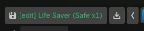

# godot-D_Lifesaver

[English](README.md) | [日本語](README.ja.md)

A Godot editor plugin that provides a "Life Saver" button in the toolbar to quickly stage and commit all changes to git. Never lose your progress again with one-click temporary backups.

## Features

- **One-Click Backup**: Stages all changes (`git add -A`) and creates a temporary commit with a timestamped message (`d_lifesaver: auto-save ...`).
- **Shortcut Trigger**: Use `Ctrl + Alt + S` (customizable) to backup instantly without using the mouse.
- **Memo & Save**: **Right-click** the button to enter an optional memo for your save.
- **History Management**:
  - **Squash**: Combine all accumulated temporary commits into a single "Refined" commit to keep your git history clean.
  - **Undo**: Quickly undo the last temporary commit using `git reset --soft`, keeping your workspace changes intact.
- **Auto-Save on Focus Loss**: Optionally trigger a backup automatically when switching away from the Godot editor.
- **Visual Status Indicators**:
  - **Safe (Green)**: Automatically detects when there are no changes to save. Displays `(Safe)`.
  - **Warning (Orange)**: Button turns amber/orange when there are unsaved changes.
  - **Urgent (Red)**: Text turns red if more than 10 minutes have passed since your last save.
- **Detailed Information**:
  - **Elapsed Time**: Shows how long ago your last commit was (e.g., `15m`).
  - **Dirty File Count**: Displays the number of files with uncommitted changes.
  - **Commit Counter**: Shows the total count of temporary commits (e.g., `x3`) on the current branch.
- **Visibility & History**:
  - See the current git branch name and the **last 3 save messages** in the button's tooltip.
  - The current branch name is also displayed directly on the button.
- **Toast Notifications**: Provides immediate visual feedback for every action and error.
- **Configurable**: Polling intervals, shortcuts, and auto-save settings can be adjusted in **Editor Settings**.

## Installation

1. Copy the `addons/godot-d_lifesaver` directory into your project's `res://addons/` folder.
2. Enable the plugin in **Project > Project Settings > Plugins**.

## Configuration

Go to **Editor > Editor Settings > d_lifesaver** to adjust:
- **Intervals**:
  - `Dirty Check Seconds`: Frequency of checking for unsaved changes (Default: 2s).
  - `Commit Count Seconds`: Frequency of updating the temporary commit count (Default: 60s).
- **Auto Save**:
  - `On Focus Loss`: Enable automatic saving when the editor loses focus (Default: false).
- **Shortcut**:
  - `Trigger`: Key combination to trigger the backup (Default: `Ctrl+Alt+S`).
